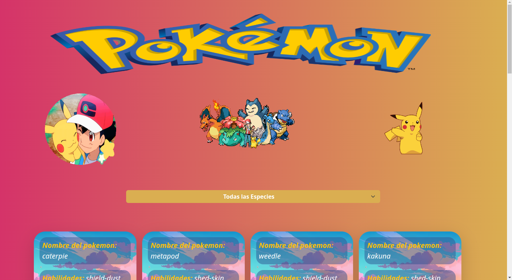
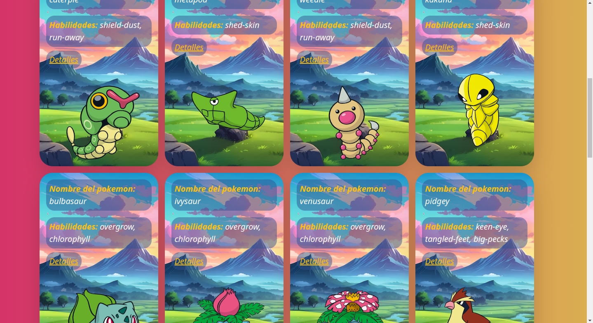

# Poke API

En este ejercicio realicé una página implementando fetch fue muy gratificante ver lo dinámico que puede llegar a ser una página, es difícil comprender muy bien este tema nuevo pero con la práctica sé que puedo mejorar.

